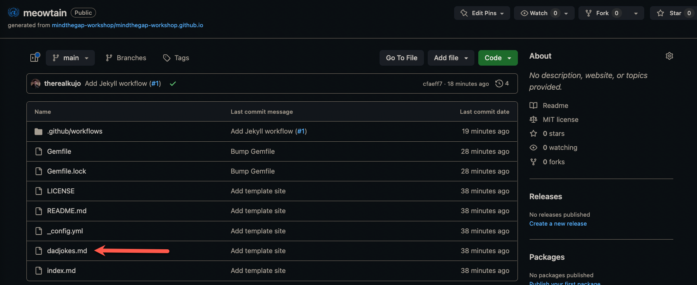
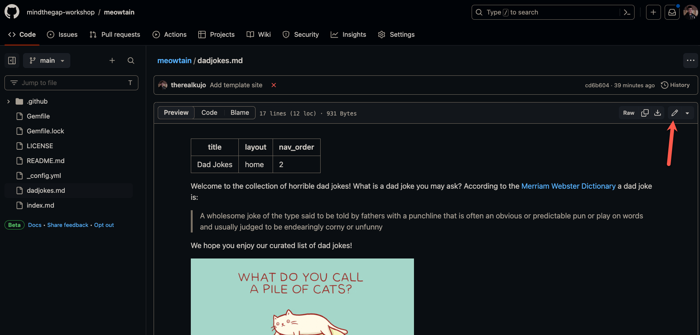
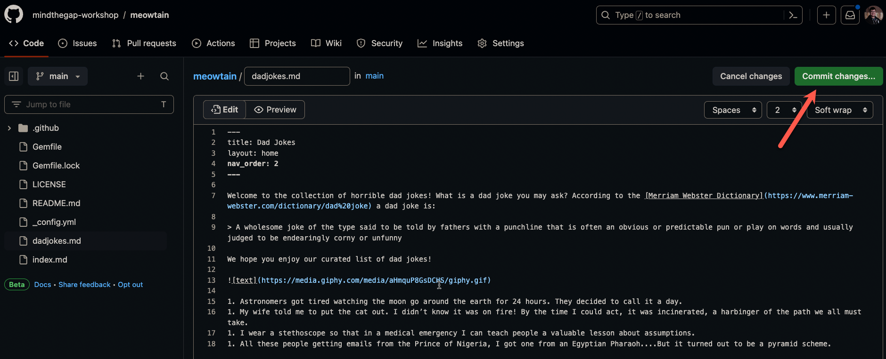
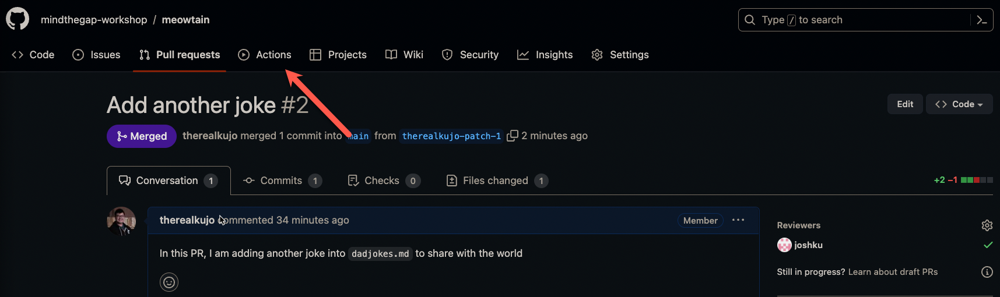

# External Developer Workshop Guide

As an external developer we are going to learn more about how we can contribute to an open source project

- Fork a repository
- Make a contribution
- Cleanup our fork
- View your contributions in production

The steps will be very similar to the team developer guide. The only difference here is that you will be _forking_ a repository rather than creating a branch in the main repository. The reason for this difference is because you are an _untrusted_ developer so you need to create a new environment to write your code.

## Step 1: Fork a repository

1. Go to your team's repository and click on the `Fork` button
    
1. You will be taken to the fork creation process. Click on `Select an owner` to find your username
    
1. Select your name in the dropdown
    
1. Once you selected your name, you should see a green checkmark besides the the name of the repo. Once you see that, press on the green `Create fork` button
    
1. You will see a screen showing you that your fork is being created
    
1. When it is complete, you will be taken to your very own forked repository
    

## Step 2: Make a contribution

1. In your root repository, click on `dadjokes.md`
    
1. Click on the pencil button
    
1. Your screen will now show a markdown editor. If you have a picture you want to add, copy line 13 into the line below and replace the url with your own image
    
1. If you want to add a joke by itself, create a new line under all the other jokes, add a `1.` and add your own joke
    
1. When you have added your joke, click on the green `Commit changes...` button
    
1. A pop up window will appear. Add a short message of what you did. Something like `Added a new joke` will do. Make sure the first option is selected and click on the green `Commit changes` button
    
1. You will now see that your commit has been added to this page
    
1. Head back to the repository homepage and you will now see a message saying you are 1 commit ahead and you will have the option to contribute. Press the contribute button
    
1. You will see a dropdown telling you that your branch is 1 commit ahead of the parent repository. Click on the green `Open pull request` button to start the PR process
    
    
1. You will be now shown a window that compares your changes with the base repository. Click on the green `Create pull request` button
    
1. Fill in the comments box and then click on the green `Create pull request` button
    
1. Just like the team developer, your PR also requires somebody to review
    
1. On the right side of your screen click on the gear icon besides `Reviewers`
    
1. In the dropdown window, type in the handle of a team developer or the team lead and select their name to add them as a reviewer
    
1. Click outside the dropdown window to close it and you should see your team lead assigned to be a reviewer
    
1. Let your team lead/developer know that there is a pull request that needs to be reviewed!

Congratulations! You have made an open source contribution! When your pull request is approved, they will merge the PR for you. 

## Step 3: Clean up

Once your PR is merged, we can safely delete our fork

1. Click on the `settings` hyperlink in your merged PR
    
1. You will be taken to your forked repo settings and a pop up window will appear asking if you are sure you want to delete your repository. Type in the name of your repository and click on the red button.
    
1. You will get sent to your profile page with a banner telling you that your repository was successfully deleted
    

Now that our fork was deleted, head back to your team's open source repository

## Step 4: Watch our code get automatically deploy

1. Head over to the `Actions` tab to watch your code get built!
    
1. You will see an icon besides the latest build. A yellow circle means that it is busy compiling your code. A green check mark means that your code was successfully built! A red circle with a black X means something went wrong. If you get a failed build, please notify the organizers for help
    
1. Once your build is complete, head on to `https://mindthegap-workshop.github.io/YOURTEAMNAME` to see your website with your new changes!

Feel free to repeat these steps to add more jokes and to submit a PR.