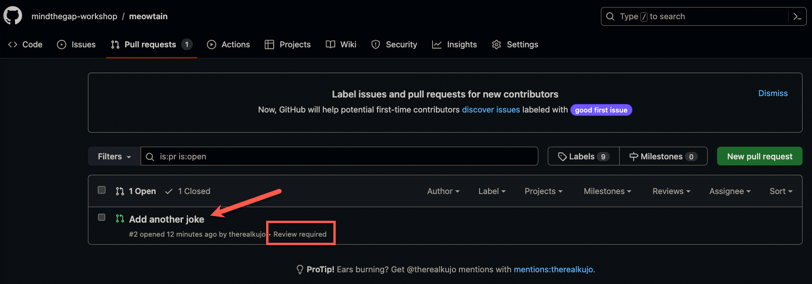
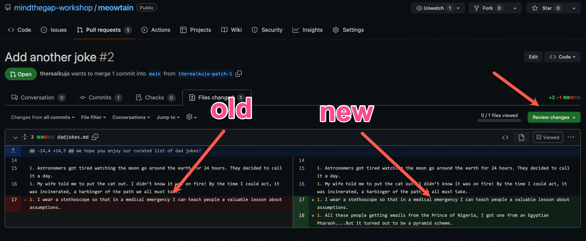
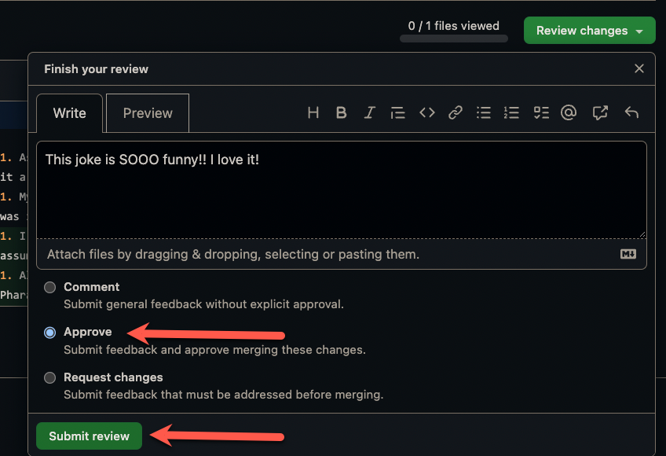
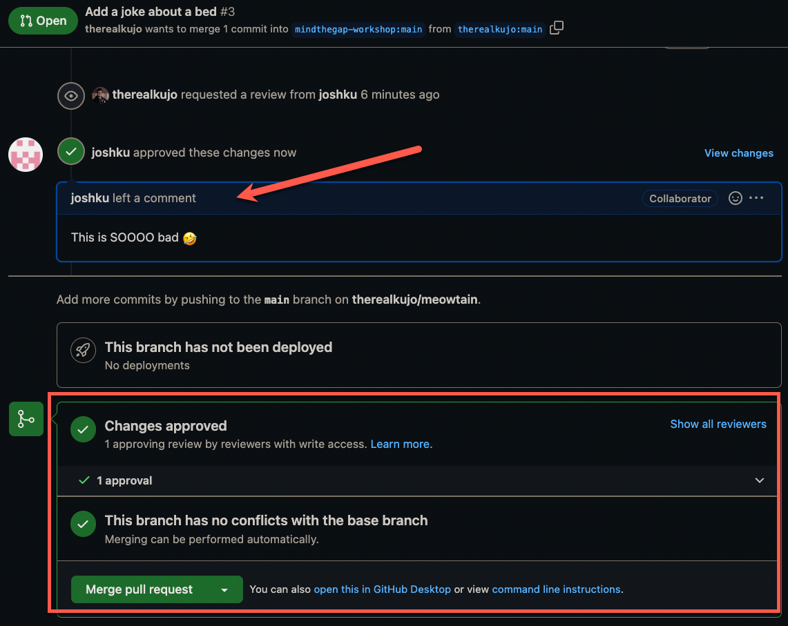

# Team Developer Workshop Guide

As a team developer we are going to learn more about how we can contribute to an open source project

- Accept invitation to collaborate
- Make a contribution
- Create a pull request
- Review an external developer's pull request

## Step 1: Accept invitation to collaborate

In your email, you should have gotten an invitation to collaborate on your team's repository. Follow the instructions to accept the invitation and gain access to the repository.

## Step 2: Make a contribution

In this step we are going to be adding our very own dad jokes!

1. In your team's root repository, click on `dadjokes.md`
    
1. Click on the pencil button
    
1. Your screen will now show a markdown editor. If you have a picture you want to add, copy line 13 into the line below and replace the url with your own image
    
1. If you want to add a joke by itself, create a new line under all the other jokes, add a `1.` and add your own joke
    
1. When you have added your joke, click on the green `Commit changes...` button
    
1. A pop up window will appear. Add a short message of what you did. Something like `Added a new joke` will do. Select the second option to create a new branch and then select the green button `Propose changes`
    
1. You will now be taken to the pull request process. Typically the title will be a short summary of what you are trying to do and the comment box will be a place for you to write a more detailed explanation of what your changes are. Feel free to try that out here. When you are happy with your message, click on the green `Create pull request` button
    
1. Once you open your pull request, you will notice that there are some X's letting you know that a review is required and merging is blocked until a review has been made
    
1. On the right side of your screen click on the gear icon besides `Reviewers`
    
1. In the dropdown window, type in the handle of your team lead and select their name to add them as a reviewer
    
1. Click outside the dropdown window to close it and you should see your team lead assigned to be a reviewer
    
1. Let your team lead know that there is a pull request that needs to be reviewed!

## Step 3: Merge your request

1. When you have been notified by your team lead that your pull request was approved, head back to your open pull request. You will see now everything is green!
    
1. If you are happy with everything click on the green `Merge pull request` button
    
1. You will be asked to confirm the merge. Just press on the green `Confirm merge`
    
1. Congratulations! You merged your pull request! You will see your PR has changed from a green `Open` to a purple `Merged`. You can now click the the `Delete branch` button as your branch is no longer needed.
    
1. You will now see your branch has been successfully deleted
    
1. Head over to the `Actions` tab to watch your code get built!
    
1. You will see an icon besides the latest build. A yellow circle means that it is busy compiling your code. A green check mark means that your code was successfully built! A red circle with a black X means something went wrong. If you get a failed build, please notify the organizers for help
    
1. Once your build is complete, head on to `https://mindthegap-workshop.github.io/YOURTEAMNAME` to see your website with your new changes!

Congratulations! You just went through the general workflow for a team developer on how to contribute to an open source repository! Feel free to repeat these steps and add more jokes! If you want to add more kinds of jokes, you can copy the `dadjokes.md` file and create a new file and add your own jokes there! The only thing you need to make sure you change is the top part of the file. Update that with a new title and change the `nav_order` to be a bigger number.

The last thing you need to do now is to learn how to review pull requests from an external developer. When you have been notified by an external developer that there is a pull request ready for your review, please proceed to the next step

## Step 4: Review an external developers pull request

When an external developer notifies you that a pull request needs to be reviewed you are ready to proceed through these steps.

1. From the home page of your team's repository, select the `Pull requests` tab
    
1. Select on the PR that needs to be reviewed. You will see a small text within that PR that says `Review required`
    
1. When the PR is opened, you should see a notifcation bar on the top of your screen letting you know that your review has been requested. Press on the green button `Add your review` to start the review
    
1. You will be taken to the `Files changed` tab where you can see on the left side what the original file was and on the right side what the new changes are. Take some time now to look at the changes and when you are ready to provide feedback, click on the green `Review changes` button
    
1. A dropdown window will show and you have the ability to add your comments. There are three types of comments you can give: 1. A general comment that does not approve, 2. A comment that approves the PR or 3. A comment that must be addressed and does not give approval. If everything looks good, feel free to approve the PR. If you want them to make any edits, you can type out what changes you want the developer to do. In this case, we will pretend you are happy
    
1. You will be taken back to the PR window and you can see now that there are green check marks and you are able to merge the pull request. Click on the green `Merge pull request` button
    
1. You will be asked to confirm the merge. If everything looks good, click on the  green `Confirm merge` button
    
1. You will now see confirmation that the PR was merged. The green `Open` should have changed to a purple `Merged` at the top of your screen and you will see the message of a merge commit. 
    

Congratulations! You just completed your first open source pull request review!