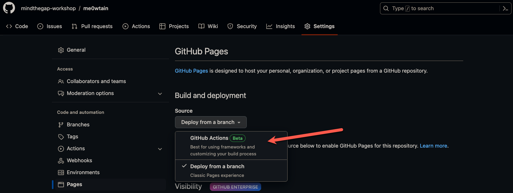
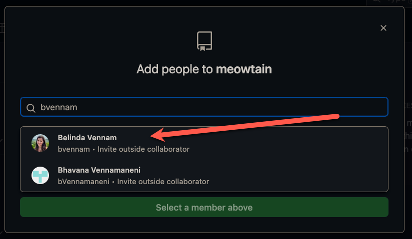
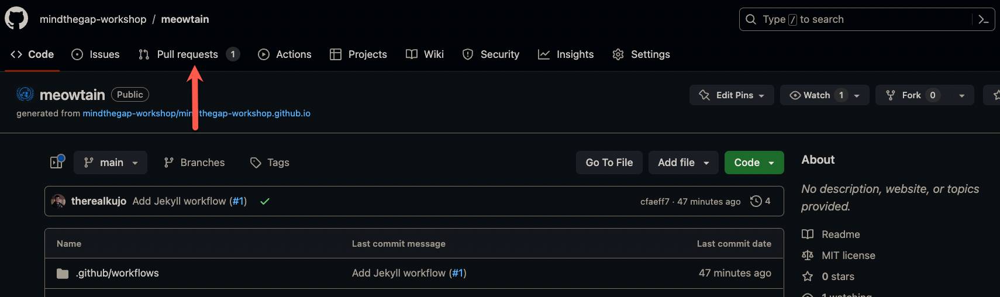

# Team Lead Workshop Guide

As a team lead we are going to learn more about the steps to open source a project

- Request access
- Create a repository
- Enable GitHub Pages
- Create branch protection rules
- Invite your developer to the repository
- Review a pull request

## Step 1: Name your team!

The most important step of this whole exercise! Please come up with a team name and make sure everybody is assigned a role. They can either be a team developer or an external developer. Each role can have multiple developers but you can assign one person to be the lead "driver" who will be the first person to walk through the exercise and share their screen with the rest of the team to show what the experience will be like.

## Step 2: Request access to the organisation

We are going to simulate the process of open sourcing a repository. In this case, you first will need access to the organisation itself.

1. Create an access request issue by clicking this [link](https://github.com/mindthegap-workshop/mindthegap-workshop.github.io/issues/new?assignees=&labels=access+request&template=access-request.md&title=ACCESS+REQUEST%3A+%40TEAM_LEAD_GITHUB_HANDLE)
1. Replace TEAM_LEAD_GITHUB_HANDLE with your github handle
1. Press `Submit new issue` when you are done

An organization admin will approve your request and invite you to be a member of the organisation. You will receive an email that you have been invited to the organisation. Follow the instructions in the email to gain access.

Once you complete this step, you will be able to "open source" a project in the next step.

## Step 3: Create a repository

In this step, we are going to create a team repository that your team will be working out of

1. Go to our [template repository](https://github.com/mindthegap-workshop/mindthegap-workshop.github.io)
1. Press the green button that says `Use this template` and select `Create a new repository`
    
1. The owner should be `mindethegap-workshop`. For the repository name, please put the name of your team
1. Make sure your repository's visiblity is set to `Public`
1. Once you are happy with all the settings press the green button `Create repository from template`
    

Congratulations! You have created your first open source repository!

## Step 4: Enable GitHub Pages

In this step, we are going to create a website so viewers can see your jokes!

1. Go to the `Settings` tab
    
1. On the left column, select `Pages`
    
1. Change `Source` to be `GitHub Actions (Beta)`
    
1. You should see a confirmation that the source was saved. Next select configure in the `GitHub Pages Jekyll` box
    
1. You will be redirected to a web editor with a workflow file already pre built. Just select the green `Commit changes...` button
    
1. A pop up window will show. Fill in the `Commit Message` with `Add GitHub pages build and deploy workflow` and make sure `Commit directly to the main branch` is selected and press the green `Commit Changes` button
    
1. Click on the `Actions` tab and watch your website get built!
    
1. When you see a green check mark besides the workflow run, your website is ready!
    
1. Go to mindthegap-workshop.github.io/TEAMNAME to see your website live!

## Step 5: Create branch protection rules

We will now be be protecting your repository so not just anybody can contribute to your repository

1. Go to the `Settings` tab
    
1. On the left column, select `Branches`
    
1. Select `Add branch protection rule`
    
1. For `Branch name pattern` type in `main`
    
1. For `Protect matching branches` select the checkboxes just like the image below
    
1. Once you have selected the checkboxes, scroll to the bottom of the screen and select `Create`
    
1. You should see a banner that says the branch protection rule is saved and you can see there is a branch protection rule in effect
    

## Step 6: Invite internal collaborators

In this step, we will be inviting UN employees to help collaborate on this open source project. The people we invite in this process are people who will share the responsibility of maintaining this project and reviewing what gets put in.

1. Go to the `Settings` tab
    
1. Select `Collaborators and teams`
    
1. Select the green `Add people` button
    
1. A pop up window will appear for you to type in the username handle of the person you want to invite
    
1. Type in the name of the person and their profile should appear in the drop down. Select that profile
    
1. You will now be asked to choose a role. Select `Maintain`. Then press the green button to send them an invitation
    
1. You will now see confirmation that the user was added as a collaborator and that an invite is pending a response
    

After this step is complete, you role as a team lead can take a pause! We will now transition to the team developer guide. Once your team developer has submitted a pull request, you can proceed to step 6

## Step 7: Review a Pull Request

When a developer notifies you that a pull request needs to be reviewed you are ready to proceed through these steps.

1. From the home page of your team's repository, select the `Pull requests` tab
    
1. Select on the PR that needs to be reviewed. You will see a small text within that PR that says `Review required`
    
1. When the PR is opened, you should see a notifcation bar on the top of your screen letting you know that your review has been requested. Press on the green button `Add your review` to start the review
    
1. You will be taken to the `Files changed` tab where you can see on the left side what the original file was and on the right side what the new changes are. Take some time now to look at the changes and when you are ready to provide feedback, click on the green `Review changes` button
    
1. A dropdown window will show and you have the ability to add your comments. There are three types of comments you can give: 1. A general comment that does not approve, 2. A comment that approves the PR or 3. A comment that must be addressed and does not give approval. If everything looks good, feel free to approve the PR. If you want them to make any edits, you can type out what changes you want the developer to do. In this case, we will pretend you are happy
    
1. Once you have submitted your feedback, let the developer know.

Congratulations! You just completed your first pull request review!